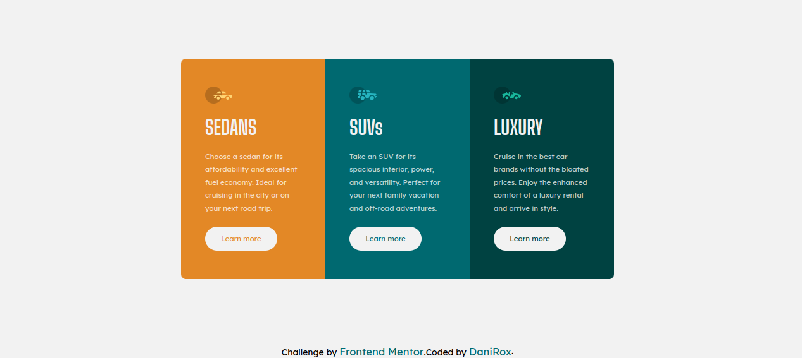

# Frontend Mentor - 3-column preview card component solution

This is a solution to the [3-column preview card component challenge on Frontend Mentor](https://www.frontendmentor.io/challenges/3column-preview-card-component-pH92eAR2-). Frontend Mentor challenges help you improve your coding skills by building realistic projects. 

## Table of contents

- [Overview](#overview)
  - [The challenge](#the-challenge)
  - [Screenshot](#screenshot)
  - [Links](#links)
- [My process](#my-process)
  - [Built with](#built-with)
  - [What I learned](#what-i-learned)
- [Author](#author)

**Note: Delete this note and update the table of contents based on what sections you keep.**

## Overview

### The challenge

Users should be able to:

- View the optimal layout depending on their device's screen size
- See hover states for interactive elements

### Screenshot




### Links

- Solution URL: [solution](https://www.frontendmentor.io/solutions/sass-flexbox-g4q1URbm7g)
- Live Site URL: [link](https://danirox.github.io/Componente-de-tarjeta/)

## My process

### Built with

- Semantic HTML5 markup
- CSS custom properties
- Sass
- Flexbox
- Mobile-first workflow


### What I learned

En este proyecto pude comprender e implementar el uso del cambio de tamaño de fuente en el html, para que luego cambien automaticamente los tamaños del sitio.


```css
.html {
  font-size: 16px;
}
```

## Author

- Website - [DaniRox](https://danirox.github.io/DaniRox-Portfolio/)
- Frontend Mentor - [@DaniRox](https://www.frontendmentor.io/profile/DaniRox)

